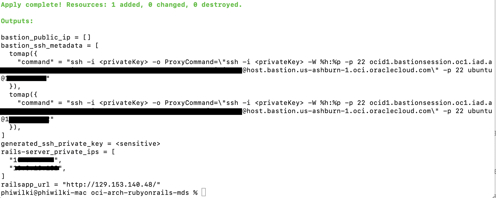
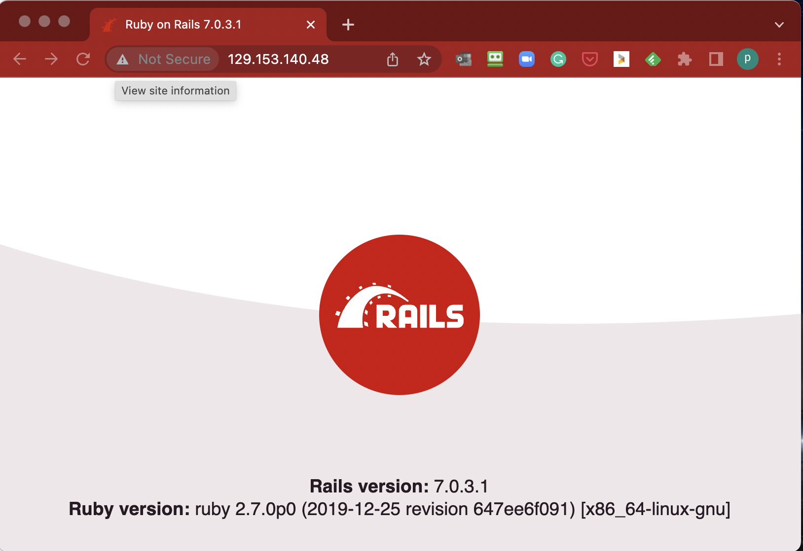

# Ruby on Rails Sample Architecture

[](https://img.shields.io/badge/license-UPL-green) [](https://sonarcloud.io/dashboard?id=oracle-devrel_oci-arch-rubyonrails-mds)

## Introduction
This reference architecture provides a scalable deployment of Ruby on Rails (RoR) servers with MySQL databases ready to be used.  It implements the same core infrastructure as the Tomcat MDS Reference architecture https://github.com/oracle-devrel/terraform-oci-arch-tomcat-mds replacing Tomcat with the RoR server ready for development.

To compliment this there is an additional Reference Architecture to provide a suitable  CI/CD pipeline - https://github.com/oracle-devrel/terraform-oci-arch-ruby-rails-devops-pipeline for the development of Ruby on Rails solutions.


For details of the architecture, see the [Oracle Architecture Center](https://docs.oracle.com/solutions/).


## Getting Started
MISSING

# Prerequisites

- Permission to `manage` the following types of resources in your Oracle Cloud Infrastructure tenancy: `vcns`, `internet-gateways`, `route-tables`, `network-security-groups`, `subnets`, `mysql-family`, and `instances`.

  

If you don't have the required permissions and quota, contact your tenancy administrator. See [Policy Reference](https://docs.cloud.oracle.com/en-us/iaas/Content/Identity/Reference/policyreference.htm), [Service Limits](https://docs.cloud.oracle.com/en-us/iaas/Content/General/Concepts/servicelimits.htm), [Compartment Quotas](https://docs.cloud.oracle.com/iaas/Content/General/Concepts/resourcequotas.htm).

## Deploy Using Oracle Resource Manager

1. Click [](https://cloud.oracle.com/resourcemanager/stacks/create?region=home&zipUrl=https://github.com/oracle-devrel/terraform-oci-arch-rubyonrails-mds/releases/latest/download/terraform-oci-arch-tomcat-mds-stack-latest.zip)

    If you aren't already signed in, when prompted, enter the tenancy and user credentials.

2. Review and accept the terms and conditions.

3. Select the region where you want to deploy the stack.

4. Follow the on-screen prompts and instructions to create the stack.

5. After creating the stack, click **Terraform Actions**, and select **Plan**.

6. Wait for the job to be completed, and review the plan.

    To make any changes, return to the Stack Details page, click **Edit Stack**, and make the required changes. Then, run the **Plan** action again.

7. If no further changes are necessary, return to the Stack Details page, click **Terraform Actions**, and select **Apply**. 

## Deploy Using the Terraform CLI

### Clone the Module

Now, you'll want a local copy of this repo. You can make that with the commands:

```
    git clone https://github.com/oracle-devrel/terraform-oci-arch-tomcat-mds.git
    cd terraform-oci-arch-tomcat-mds
    ls
```

### Prerequisites
First off, you'll need to do some pre-deploy setup.  That's all detailed [here](https://github.com/cloud-partners/oci-prerequisites).

Create a `terraform.tfvars` file, and specify the following variables:

```
# Authentication
tenancy_ocid         = "<tenancy_ocid>"
user_ocid            = "<user_ocid>"
fingerprint          = "<finger_print>"

# Region
region = "<oci_region>"

# Compartment
compartment_ocid = "<compartment_ocid>"

# Number of Ruby On Rails nodes (optional)
numberOfNodes = 2

# MySQL DBSystem Admin Password - mandatory
mysql_db_system_admin_password = "<mysql_db_system_admin_password>"

````

### Create the Resources
Run the following commands:

    terraform init
    terraform plan
    terraform apply


### Testing your Deployment
After the deployment is finished, you can test that your RoR was deployed correctly . The Terraform output should end with something like this:



Pick up the address of the server from the Terraform output shown with :

````
railsapp_url = http://129.153.140.48/
`````

Then copy it into Web browser. Here is the example of the succesfull outcome:



As the load balancer alternates between the 2 Ruby on Rails nodes, the session data should persist.

### Destroy the Deployment
When you no longer need the deployment, you can run this command to destroy the resources:

    terraform destroy

## Notes/Issues
None

## URLs
* Nothing at this time

## Contributing
This project is open source.  Please submit your contributions by forking this repository and submitting a pull request!  Oracle appreciates any contributions that are made by the open source community.

## License
Copyright (c) 2021 Oracle and/or its affiliates.

Licensed under the Universal Permissive License (UPL), Version 1.0.

See [LICENSE](LICENSE) for more details.
